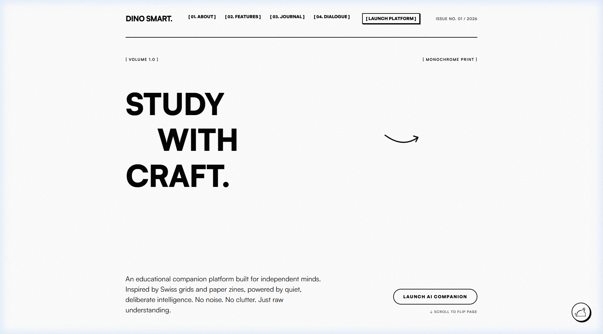
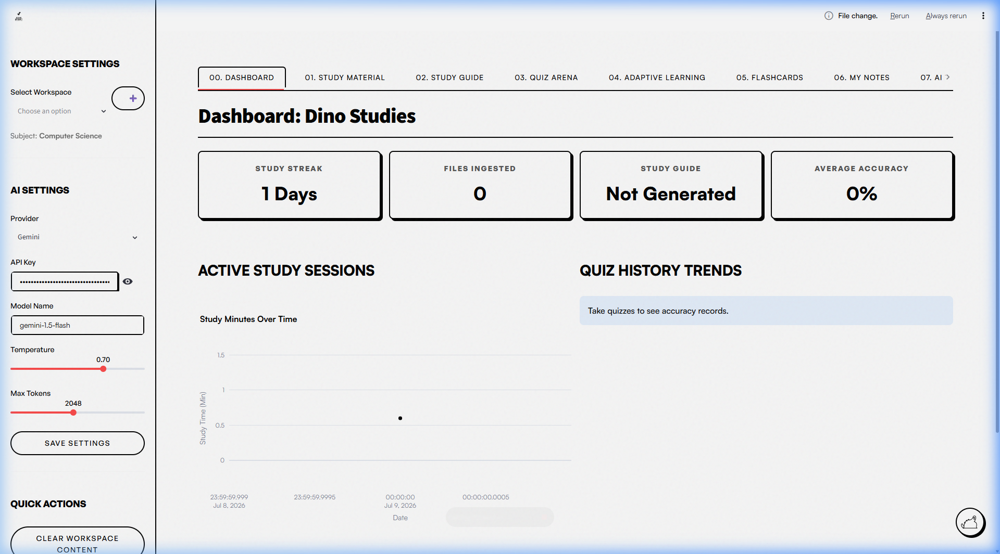
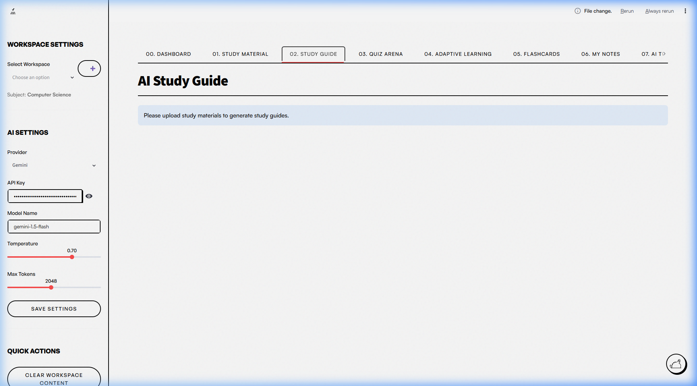
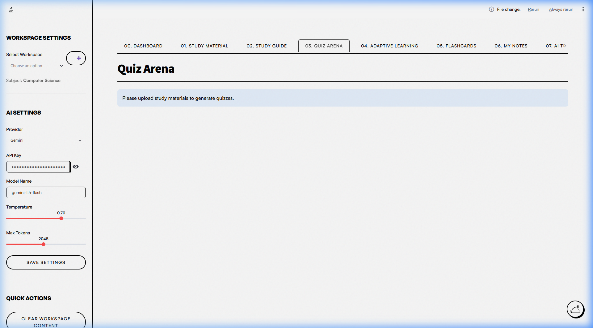
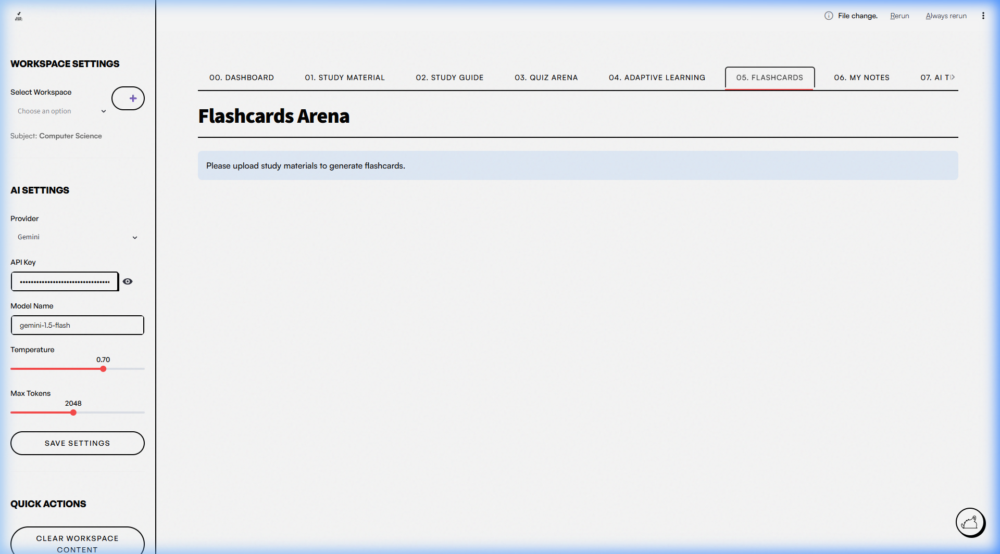

# 🦕 Dino Smart — Handcrafted Editorial AI Companion

Welcome to **Dino Smart**, an educational companion platform built for independent minds. Inspired by Swiss typographic grids, vintage paper zines, and clean minimalist editorial layouts, Dino Smart offers a quiet, distraction-free environment for parsing, organizing, and mastering your study materials.

No flashing banners. No clutter. Just raw understanding.

---

## 📖 Table of Contents
1. [Overview & Philosophy](#-overview--philosophy)
2. [Visual Tour & Screenshots](#-visual-tour--screenshots)
3. [Key Modules & Features](#-key-modules--features)
4. [Technology Stack](#-technology-stack)
5. [Project Directory Structure](#-project-directory-structure)
6. [Setup & Installation](#-setup--installation)
7. [AI Provider & Smart Router Configuration](#-ai-provider--smart-router-configuration)

---

## 🎨 Overview & Philosophy
Most educational software makes you feel like an operator in a control center with endless dials, flashing metrics, and charts. **Dino Smart is the anti-dashboard.** 

We believe learning is a tactile, structured process. The user interface mimics the layout of a physical, handcrafted textbook, structured into editorial columns, high-contrast borders, and textured layouts. Under the hood, Dino Smart uses advanced multimodal AI to parse text, documents, and images (OCR), transforming them into digestible study guides, active recall cards, and interactive quiz sessions.

---

## 📸 Visual Tour & Screenshots

Here is a preview of the Dino Smart experience:

### 🏠 The Editorial Landing Page
*A minimalist newspaper-style layout with a retro paper grain noise overlay and an interactive hand-drawn mascot (Dino) to welcome you.*


### 📊 Workspace Dashboard
*Your learning nerve center. Track your study streak, see how many files are ingested, and monitor your average test performance.*


### 📄 Editorial Study Guide
*Your documents transformed into highly readable, publication-ready study brochures. Exportable directly to Markdown, PDF, and DOCX.*


### ⚔️ Quiz Arena
*Generate interactive quizzes with custom difficulty and question counts. Review your accuracy and get immediate breakdowns of correct vs. incorrect answers.*


### 🗂️ Interactive Flashcards
*Tactile active recall cards that flip over to show answers, allowing you to flag difficult cards for targeted review.*


---

## 🚀 Key Modules & Features

Dino Smart operates on a **Workspace model**, letting you separate topics (e.g., *Computer Science*, *Organic Chemistry*, or *World History*). Each workspace contains the following 9 modules:

1. **Dashboard**: Track your current study streak (days), number of files ingested, study guide generation status, and overall average test accuracy.
2. **Study Material**: Upload your notes, textbooks, slides, or images. Supports extracting text from PDFs, Microsoft Word (`.docx`), PowerPoint (`.pptx`), and raw text files. For images (JPEG, PNG, WEBP), it performs advanced vision-based OCR.
3. **Study Guide**: Automatically formats ingested notes and files into a cohesive, structured study guide. You can search, browse, and export the guides in Markdown format.
4. **Quiz Arena**: Generate customized quizzes (multiple choice) matching your exact study materials. Keep track of your scores in the historical database.
5. **Adaptive Learning**: Dino Smart detects areas where you performed poorly on quizzes or flagged cards and provides simplified, ELI10 (Explain Like I'm 10) analogies and targeted challenges.
6. **Flashcards**: Standard and flagged active recall cards with a custom-engineered HTML/CSS layout and a flipping mechanism.
7. **My Notes**: A persistent, distraction-free markdown notebook stored inside each workspace database.
8. **AI Tutor**: A chat environment grounded strictly in your uploaded workspace documents. Ask questions, clarify definitions, or request code explanations.
9. **Revision Hub**: Automatically generates cheat sheets, formulas, key terminology lists, and a personalized study schedule.

---

## 🛠️ Technology Stack

- **Landing Page**: HTML5, Vanilla JavaScript, CSS3 (using *Satoshi* & *General Sans* typography, custom hand-drawn SVGs, and a dynamic noise overlay).
- **Core Application**: [Streamlit](https://streamlit.io/) (with heavy custom CSS injections for a retro, clean zine aesthetic).
- **Database**: SQLite3 (offline-first local database tracking workspaces, uploads, progress logs, quizzes, and flashcards).
- **File Processors**: `pypdf`, `python-docx`, `python-pptx`, `Pillow` (PIL) for image handling.
- **LLM Integrations**: Native SDKs for **Gemini** (Google) and **OpenAI compatible endpoints** (supporting **Groq**, **OpenRouter**, **DeepSeek**, and local **Ollama** models).

---

## 📂 Project Directory Structure

```text
├── Dino_smart/              # Python Streamlit Application
│   ├── components/          # Streamlit UI Custom Elements (styles, flashcards, mermaid rendering)
│   ├── database/            # SQLite study_buddy.db and DB Manager module
│   ├── exports/             # Exported files (Markdown, etc.)
│   ├── guides/              # Generated study guide logs
│   ├── images/              # Local image files
│   ├── providers/           # API adapters (LLM Factory, Gemini, OpenAI, Smart Router)
│   │   ├── base_provider.py
│   │   └── llm_factory.py
│   ├── quizzes/             # Generated quiz logs
│   ├── services/            # Core business logic (chat, OCR, flashcards, guides, quizzes, revision)
│   ├── uploads/             # Ingested user documents
│   ├── utils/               # File export helper modules
│   ├── app.py               # Streamlit main entry point
│   ├── config.json          # Saved API keys and model configurations
│   └── fix_now.py           # Diagnostic script to fix styles and layouts
│
├── assets/                  # Public assets
│   └── screenshots/         # Captured screenshots featured in README
│
├── index.html               # Platform Landing Page (HTML5)
├── style.css                # Landing page zine-styled stylesheet
├── script.js                # Interactive landing page logic
└── requirements.txt         # Python project dependencies
```

---

## ⚙️ Setup & Installation

### 1. Clone & Prepare the Environment
Ensure you have Python 3.10 or higher installed. Navigate to the project root and create a virtual environment:

```bash
# Create a virtual environment
python -m venv .venv

# Activate the virtual environment
# On Windows:
.venv\Scripts\activate
# On macOS/Linux:
source .venv/bin/activate

# Install the required packages
pip install -r requirements.txt
```

### 2. Configure Your Keys
You can configure your keys directly inside the application's sidebar or by editing `Dino_smart/config.json`:

```json
{
    "provider_name": "Gemini",
    "Gemini_api_key": "YOUR_GEMINI_API_KEY",
    "Gemini_model_name": "gemini-1.5-flash",
    "Groq_api_key": "YOUR_GROQ_API_KEY",
    "OpenRouter_api_key": "YOUR_OPENROUTER_API_KEY"
}
```

### 3. Run the Platform

#### Launch the Streamlit App:
```bash
streamlit run Dino_smart/app.py
```
*The app will automatically open in your browser, typically at `http://localhost:8501`.*

#### Open the Landing Page:
You can simply double-click `index.html` to open it in your browser, or serve it locally using python:
```bash
python -m http.server 8000
```
Then visit `http://localhost:8000` in your web browser.

---

## 🧠 AI Provider & Smart Router Configuration

Dino Smart supports multiple providers (Gemini, Groq, OpenRouter, DeepSeek, Ollama). By default, it features a **Smart Router Mode**:

- **Short Chat Queries**: Routes to `Groq` $\rightarrow$ `OpenRouter` $\rightarrow$ `Gemini` for rapid responses.
- **Large Contexts & OCR**: Routes to `Gemini` $\rightarrow$ `OpenRouter` $\rightarrow$ `Groq` to make use of Gemini's massive context window and advanced vision capabilities.
- **Auto-Cascade failover**: If a provider is slow, offline, rate-limited, or has missing credentials, the system automatically falls back to the next provider instantly without interrupting your study session.
